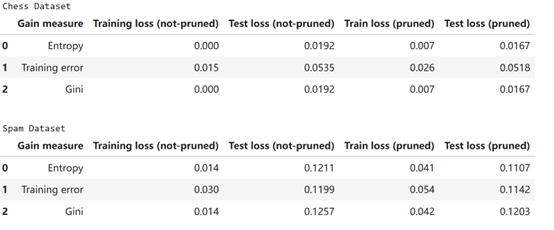
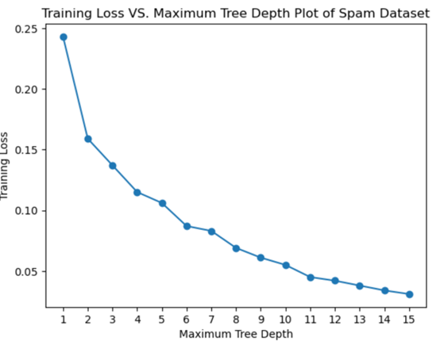
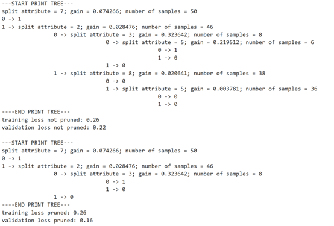

# Model Complexity & Overfitting Trade-off in Decision Trees on Binary Classifications

This project implements a **binary Decision Tree classifier from scratch** to study the **model complexity vs. overfitting trade-off** on real classification tasks. The code includes a full training pipeline with **data preprocessing that converts multi-valued features into binary indicators** , a recursive tree builder with **information-gain splitting** using interchangeable impurity measures (**entropy**, **Gini**, or **training-error gain**), **max-depth control** for complexity, and **validation-set post-pruning** to improve generalization. It evaluates performance on both a **chess outcome dataset** and a **spam email dataset**, reporting **train/test loss (pruned vs. unpruned)** and generating plots such as **training loss vs. maximum tree depth** to visualize overfitting behavior.

**Repository contents**
- `deci_tree_code.ipynb` — jupyter notebook containing the full write-up, derivations, experiments, and visualization results.
- `environment.yaml` — environment setup file.
- `toy_train.csv` and `toy_val.csv`:
   -**Testing correctness** of the decision tree and tree pruning implementation (sanity checks).
- `chess.csv` — Each row of the `chess.csv` dataset contains 36 features, which represent the current state of the chess board. Given this representation, the task is to use the Decision Trees to classify whether or not it is possible for white to win the game. For more information on the dataset, see here.
- `spam.csv` — The dataset features attributes such as the frequency of certain words and the amount of capital letters in a given message. One can find more details on the dataset here. I will only be using a subset of the full dataset.

## Author / Contact
- Jiaqi Zhang — jiaqi_zhang7@brown.edu  

## Environment
Developed and tested with:
- Python **3.12.11**
- matplotlib **3.10.5**
- pandas **2.3.2**
- scikit-learn **1.7.1**
- numpy **2.3.2**
- pytorch **2.7.1**
- jupyter
- pytest **8.4.1**
- quadprog

One can use `environment.yaml` in the Repo to set up the above environment.

To set up, run:

`conda env create -f environment.yml`

`conda activate deci`  

## Core Methods and Functions
- `DecisionTree(data, validation_data=None, gain_function=node_score_entropy, max_depth=40)`: creates a DecisionTree that greedily minimizes training error on the given dataset. The depth of the tree should not be greater than max_depth. If `validation_data` is passed as an argument, the validation data should be used to prune the tree after it has been constructed.

- `predict(features)`: predicts a label 0 or 1 given input n dimensional features that have `bool` types. Note that in our implementation features are represented as Python `bool` types (`True`, `False`) and class labels are Python `int`s `(0, 1)`.

- `accuracy(data)`: computes accuracy, defined as `1-loss(self, data)`.

- `loss(data)`: computes the training error, or the average loss.

- `_predict_recurs(self, node, row)`: Helper function to predict the label given a row of features. Traverse the tree until leaves to get the label.

- `_prune_recurs(self, node, validation_data)`:  Prune the tree bottom up recursively. Nothing needs to be returned.
    - It will not prune if the node is a leaf.
    - It will not prune if the node is non-leaf and has at least one non-leaf child.
    - It will Prune if deleting the node could reduce loss on the validation data.

- `_is_terminal(self, node, data, indices)`:  Helper function to determine whether the node should stop splitting.
    - Stop the recursion if:
        - 1. The dataset (as passed to parameter data) is empty.
        - 2. There are no more indices to split on.
        - 3. All the instances in this dataset belong to the same class
        - 4. The depth of the node reaches the maximum depth.
    - Set the node label to be the majority label of the training dataset if:
        - 1. The number of class 1 points is equal to the number of class 0 points.
        - 2. The dataset is empty.
    - Return:
        - A boolean, True indicating the current node should be a leaf and False if the node is not a leaf.
        - A label, indicating the label of the leaf (or the label the node would 
              be if we were to terminate at that node). If there is no data left, it
              must return the majority class of the training set.

- `_split_recurs(self, node, data, indices)`: Recursively split the node based on the rows and indices given. Nothing needs to be returned.
    - First use _is_terminal() to check if the node needs to be split.
    - If so, select the column that has the maximum infomation gain to split on.
    - Store the label predicted for this node, the split column, and use _set_info() to keep track of the gain and the number of datapoints at the split.
    - Then, split the data based on its value in the selected column.
    The data should be recursively passed to the children.

- `_calc_gain(self, data, split_index, gain_function)`: Calculate the gain of the proposed splitting and return it.
    - Gain = C(P[y=1]) - P[x_i=True] * C(P[y=1|x_i=True]) - P[x_i=False] * C(P[y=0|x_i=False])
    - Here the C(p) is the gain_function. For example, if C(p) = min(p, 1-p), this would be considering training error gain. Other alternatives are entropy and gini functions.
    
- `print_tree(self)`: Helper function for tree_visualization. Only effective with very shallow trees.

- `loss_plot_vec(self, data)`: Helper function to visualize the loss when the tree expands.

- `_loss_plot_recurs(self, node, rows, prev_num_correct)`: Helper function to visualize the loss when the tree expands.

## Notes
- Results should be reproducible by using the pinned package versions above and running the project in the gaussnb conda environment.
- Some Plots and Tables for Preview:

