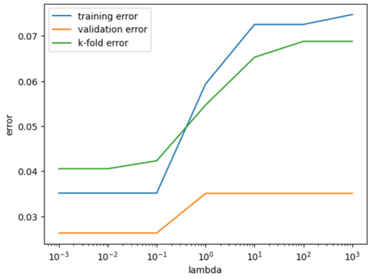

# Regularized Logistic Regression With Cross-Validation Evaluation

**Repository contents**
- `logistic_code.ipynb` — jupyter notebook containing the full write-up, derivations, experiments, and visualization results.
- `environment.yaml` — environment setup file.

## Author / Contact
- Jiaqi Zhang — jiaqi_zhang7@brown.edu  

## Environment
Developed and tested with:
- Python **3.12.11**
- matplotlib **3.10.5**
- pandas **2.3.2**
- scikit-learn **1.7.1**
- numpy **2.3.2**
- pytorch **2.7.1**
- jupyter
- pytest **8.4.1**
- quadprog

One can use `environment.yaml` in the Repo to set up the above environment.

To set up, run:

`conda env create -f environment.yml`

`conda activate logi`  

## Core Methods and Functions

## Notes
- Results should be reproducible by using the pinned package versions above and running the project in the gaussnb conda environment.
- Some Plots and Graphs for Preview:

Title: Plot of Regularization parameter VS. Three Types of Errors

