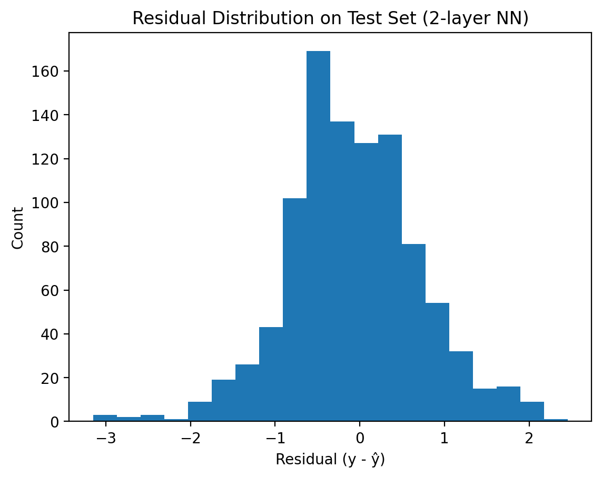
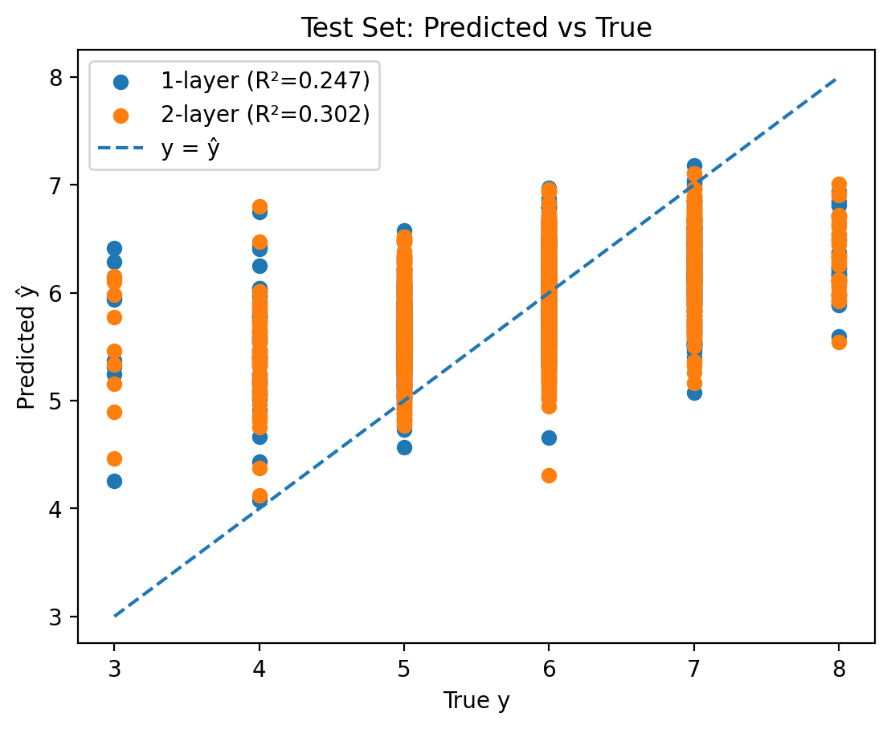

# Build and Train 1- and 2-Layer Neural Networks (SGD + Backprop) From Scratch

This project implements **shallow neural networks from scratch** and trains them using **mini-batch stochastic gradient descent (SGD)** on the Wine Quality dataset. It includes both a **1-layer linear model** (bias included via an augmented feature column) and a **2-layer network with one hidden layer** trained via **manual backpropagation** (explicit gradients for weights and biases). The workflow covers **data normalization**, reproducible train/test splitting, and portfolio-style evaluation with **learning curves (train vs test MSE)**, **predicted-vs-true plots with R²**, and **residual distribution analysis** to assess convergence and generalization.

**Repository contents**
- `nn.ipynb` — jupyter notebook containing the full write-up, derivations, experiments, and visualization results.
- `environment.yaml` — environment setup file.
- `wine.txt` — dataset that contains attributes of wines as well as wine quality. The data is formatted as follows: The first column
of data in each file is the dependent variable (the observations $y$)
and all other columns are the independent input variables ($x_{1}, x_{2}, \ldots, x_{n}$). For more information about the dataset, one can find it [here](https://archive.ics.uci.edu/ml/datasets/wine).

## Author / Contact
- Jiaqi Zhang — jiaqi_zhang7@brown.edu  

## Environment
Developed and tested with:
- Python **3.12.11**
- matplotlib **3.10.5**
- pandas **2.3.2**
- scikit-learn **1.7.1**
- numpy **2.3.2**
- pytorch **2.7.1**
- jupyter
- pytest **8.4.1**
- quadprog

One can use `environment.yaml` in the Repo to set up the above environment.

To set up, run:

`conda env create -f environment.yml`

`conda activate nn`  

## Core Methods and Functions

## Notes
- Results should be reproducible by using the pinned package versions above and running the project in the gaussnb conda environment.
- Some Plots and Graphs for Preview:

    

    

    